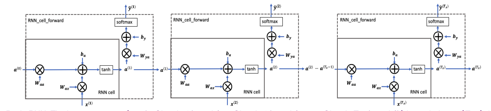
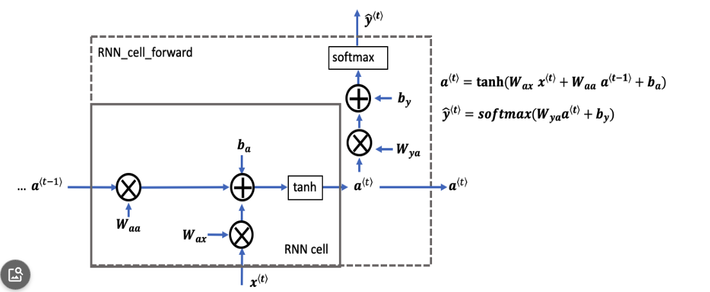
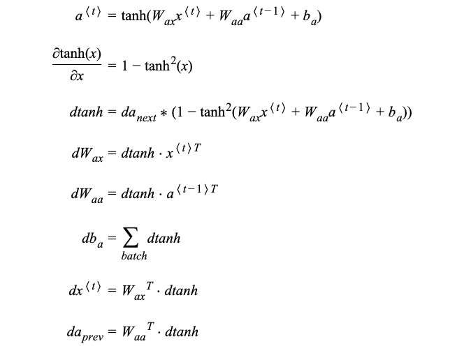
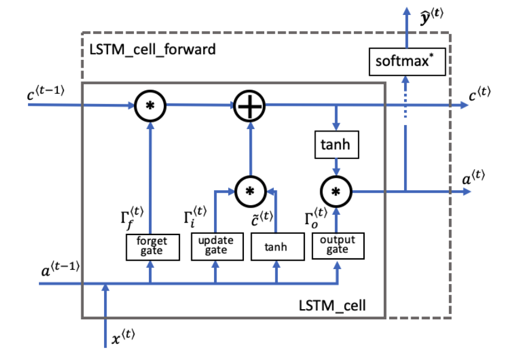
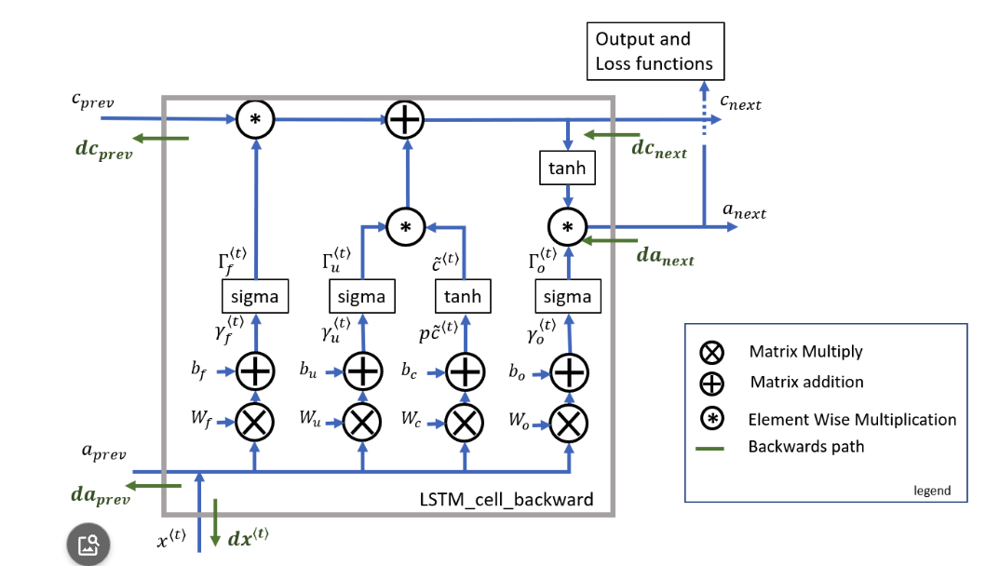
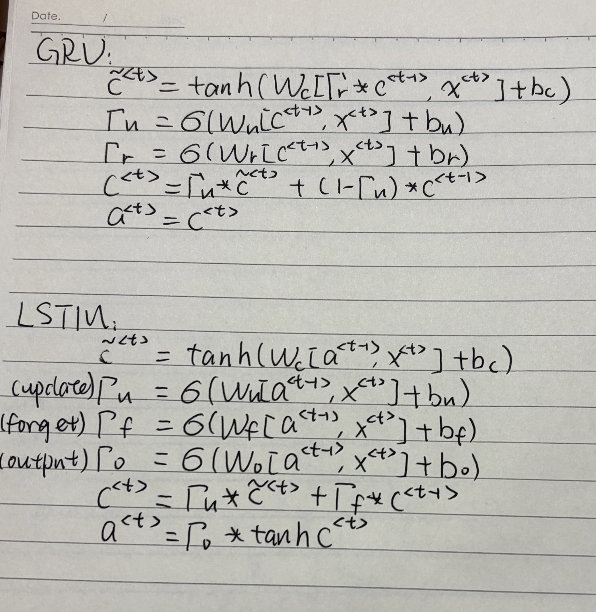
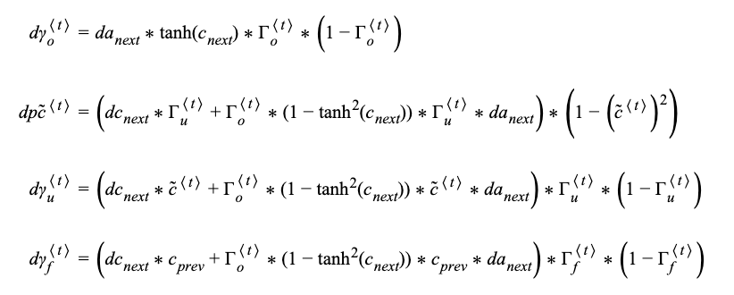
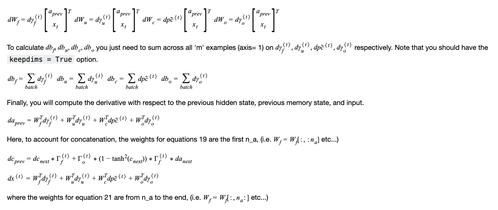

# RNN Memo

## 1. RNN overview

A vanilla recurrent neural network processes a sequence one step at a time. At each time step $t$, the cell takes the input vector $x^{(t)}$ and the previous hidden state $a^{(t-1)}$ to produce a new hidden state $a^{(t)}$.

This sequence diagram shows how the RNN cell is reused across time steps and how the hidden state flows forward from `t-1` to `t`.

## 2. Forward propagation

Within each cell, the hidden state update and output are:

$$
 a^{(t)} = \tanh\bigl(W_{ax} x^{(t)} + W_{aa} a^{(t-1)} + b_a\bigr)
$$

$$
 \hat{y}^{(t)} = \text{softmax}\left(W_{ya} a^{(t)} + b_y\right)
$$

The RNN cell graph shows the combination of input and recurrent state, the bias addition, the `tanh` activation, and the output softmax layer.

## 3. Backward propagation

The backward propagation diagram summarizes how gradients flow through time into the recurrent weights and inputs.

Key steps in backpropagation through time include:

- compute `dtanh = da_next * (1 - tanh^2(z))`
- update `dW_{ax}` and `dW_{aa}` from the current step
- propagate `da_prev = W_{aa}^T * dtanh` back to the previous time step

## 4. Why use `tanh` for the hidden state?

- `tanh` is zero-centered, which helps keep the hidden state balanced around zero and avoids introducing a strong bias shift in gradient updates.
- It compresses values to the range `[-1, 1]`, which stabilizes the recurrent state and prevents activations from growing without bound.
- Its derivative, `1 - tanh^2(x)`, remains moderate for inputs near zero, which helps gradients propagate through time better than sigmoid.
- In practice, `tanh` gives richer, signed hidden-state dynamics than a non-negative activation, making it a better default for recurrent hidden layers.

## 5. LSTM memo

A long short-term memory (LSTM) cell is a gated RNN that helps preserve information over longer sequences. It uses forget, input, and output gates to control when information is written, retained, and exposed from the cell state.

### LSTM core equations

$$
 f^{(t)} = \sigma\bigl(W_f [a^{(t-1)}, x^{(t)}] + b_f\bigr)
$$

$$
 i^{(t)} = \sigma\bigl(W_i [a^{(t-1)}, x^{(t)}] + b_i\bigr)
$$

$$
 o^{(t)} = \sigma\bigl(W_o [a^{(t-1)}, x^{(t)}] + b_o\bigr)
$$

$$
 \tilde{c}^{(t)} = \tanh\bigl(W_c [a^{(t-1)}, x^{(t)}] + b_c\bigr)
$$

$$
 c^{(t)} = f^{(t)} \odot c^{(t-1)} + i^{(t)} \odot \tilde{c}^{(t)}
$$

$$
 a^{(t)} = o^{(t)} \odot \tanh\bigl(c^{(t)}\bigr)
$$

### Why LSTM helps

- The forget gate `f^(t)` decides how much previous cell state to keep.
- The input gate `i^(t)` controls how much new candidate state `\tilde{c}^(t)` enters the cell.
- The output gate `o^(t)` decides how much of the cell state is exposed as the hidden state.
- This gating reduces vanishing gradient problems by providing a more direct path for gradients through the cell state.

The second backward diagram expands on how gradients propagate through the gates and cell state during backpropagation through time.

